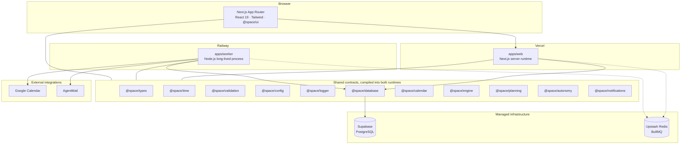

# Space

**Space is a personal planning platform.** Tasks, deadlines, calendar events and reminders live in
one canonical timeline, continuously resolved by a deterministic scheduling engine.

This repository is at **Stage 12 — Production Deployment & Live Integration**. The Space Engine
(prioritisation, scheduling, conflict resolution, workload enforcement), Google Calendar
synchronisation, a notification and email delivery layer (AgentMail), and an autonomous
feedback loop (drift detection, staleness, deadline escalation, automated reschedule proposals)
are all implemented and tested. Deploy configs for Vercel, Railway, Supabase and Upstash are
committed and verified locally. Every claim below carries an explicit verification label
(`VERIFIED LOCALLY`, `VERIFIED IN CI`, etc.); nothing is presented as deployed until it
actually is.

> **No AI.** There is no LLM, generative model, ML system or AI API anywhere in this project, and
> none will be introduced. Scheduling is a constraint problem, not a prediction problem.

---

## Table of contents

- [Product vision](#product-vision)
- [Architectural principles](#architectural-principles)
- [Architecture](#architecture)
- [Monorepo structure](#monorepo-structure)
- [Applications](#applications)
- [Packages](#packages)
- [Local setup](#local-setup)
- [Environment variables](#environment-variables)
- [Database](#database)
- [Development commands](#development-commands)
- [Testing](#testing)
- [Build](#build)
- [Deployment model](#deployment-model)
- [Production readiness](#production-readiness)
- [Adding a new package](#adding-a-new-package)
- [Conventions](#conventions)

---

## Product vision

A user's **Space** is their day: everything they have committed to, in one place. Space does not just
store that list — it is responsible for **when** each item happens, and for keeping that answer
correct as the day changes.

That responsibility is discharged by the **Space Engine**: a set of deterministic units that resolve
priorities, deadlines, conflicts and workload into a concrete schedule.

| #   | Engine                   | Responsibility                                   | Status      |
| --- | ------------------------ | ------------------------------------------------ | ----------- |
| 01  | Planning                 | Turns intent into candidate work for a horizon   | Implemented |
| 02  | Scheduling               | Places work into concrete time blocks            | Implemented |
| 03  | Priority                 | Orders competing work under one ruleset          | Implemented |
| 04  | Conflict                 | Detects and resolves overlapping commitments     | Implemented |
| 05  | Deadline                 | Works backwards from dates that cannot move      | Implemented |
| 06  | Rescheduling             | Repairs the plan with the smallest possible edit | Implemented |
| 07  | Workload                 | Enforces capacity so days stay achievable        | Implemented |
| 08  | Calendar synchronisation | Reconciles Space with external calendars         | Implemented |
| 09  | Notification             | Decides what is worth interrupting a user for    | Implemented |
| 10  | Monitoring               | Observes drift between the plan and reality      | Implemented |

The engine is **rule-based and deterministic**. The same inputs always produce the same schedule, and
every decision traces back to the rule that produced it.

---

## Architectural principles

1. **Space is the source of truth** for planned work. Google Calendar is an integration, not the
   database.
2. **The web application and the worker are independently deployable.** Neither imports the other.
3. **Background work never depends on serverless execution.** Long-running and retryable work belongs
   to the worker process, not to a request handler.
4. **No in-memory timers for production scheduling.** Durable scheduling is handled by BullMQ on
   Redis.
5. **Domain logic lives outside React components.** Components render; packages decide.
6. **External integrations are isolated behind dedicated packages**, so a provider can be replaced
   without touching the domain.
7. **Contracts are shared, implementations are not.** Types and validation are reusable by both
   runtimes; server implementation is not reachable from the browser.
8. **Timestamps are instants.** Wall-clock strings without an offset are rejected at the boundary,
   and timezones are stored as IANA identifiers so DST is resolved at evaluation time.
9. **Secrets never enter the client bundle**, and never enter the repository.
10. **Modular boundaries inside one repository.** Services can be split out later if scale requires
    it; premature microservices are not a design goal.

---

## Architecture



All edges are implemented. The web app and worker are separate processes — neither imports the
other. Web handles request/response (landing, auth, dashboard, planner, calendar connect,
notifications, settings); worker owns all durable, retryable background work: calendar sync,
notification delivery, retention maintenance, and the autonomous feedback loop.

---

## Monorepo structure

```
space/
├── apps/
│   ├── web/                    Next.js 16 application (App Router)
│   └── worker/                 Standalone Node.js background runtime
├── packages/
│   ├── autonomy/               Staleness, drift detection, reschedule proposals
│   ├── auth/                   Sessions, Google sign-in, AEAD-encrypted tokens
│   ├── calendar/               Google OAuth flows, token custody, sync engine
│   ├── config/                 Environment schemas and validated configuration
│   ├── database/               Prisma schema, migrations, repositories
│   ├── engine/                 Deterministic scheduling engine (priority, conflict, deadline, workload)
│   ├── eslint-config/          Shared flat ESLint configurations
│   ├── logger/                 Structured logging (pino) with credential redaction
│   ├── metrics/                Zero-dependency Prometheus registry
│   ├── notifications/          Delivery policies, sweep, templates, AgentMail provider
│   ├── planning/               Plan-my-day service, outbox, day-state reader
│   ├── time/                   Clock abstraction and timezone-safe calendar math
│   ├── types/                  Framework-free domain types and vocabulary
│   ├── typescript-config/      Shared tsconfig bases
│   ├── ui/                     React component library (shadcn/ui foundation)
│   └── validation/             Zod schemas and boundary parsing
├── docs/
│   ├── authentication.md       Identity, session model, E2E sign-in, security
│   ├── database.md             Schema, timezone rules, migrations, indexing
│   └── stage-12-production-deployment.md  Full deployment audit, runbooks, A–Z report
├── .github/workflows/ci.yml    Lint, typecheck, test, build, integration, e2e
├── apps/web/vercel.json        Vercel deploy config
├── railway.json                Railway worker deploy config
├── docker-compose.yml          Local PostgreSQL for migrations and integration tests
├── turbo.json                  Task graph and caching
└── pnpm-workspace.yaml         Workspace members and the version catalog
```

Packages are **internal source packages**: they export TypeScript directly and are compiled by the
consumer (Next.js via `transpilePackages`, the worker via `tsup`). There is no per-package build
step, so there are no stale `dist/` artifacts and no build ordering to get wrong.

---

## Applications

### `apps/web` — Next.js application

- Next.js 16 App Router, React 19, strict TypeScript.
- Tailwind CSS v4 with design tokens in `src/app/globals.css`.
- Geist Sans / Geist Mono, self-hosted — no runtime font fetch.
- Entrance animations via `motion/react`; skipped for users who prefer reduced motion.
- CSP, HSTS, and all security headers applied from `next.config.ts` / `vercel.json`.

**Public surface:** landing page at `/`.
**Authenticated surfaces:**

| Route                        | Purpose                                                 |
| ---------------------------- | ------------------------------------------------------- |
| `/login`                     | Google sign-in                                          |
| `/onboarding`                | Account setup (feeds the engine)                        |
| `/dashboard`                 | Today's overview                                        |
| `/space` and `/space/[date]` | Full planner with timeline, tasks, priority, conflicts  |
| `/calendar`                  | Connect/disconnect Google Calendar, trigger manual sync |
| `/notifications`             | Notification inbox, read/unread                         |
| `/settings`                  | Preferences and autonomy controls                       |

Server API routes: `/api/auth/*` (better-auth), `/api/plan` (day planner), `/api/calendar/*`
(status, sync, connect, disconnect, callback), `/api/notifications/*`, `/api/healthz`,
`/api/readyz`.

### `apps/worker` — background runtime

A long-lived Node.js process with **no dependency on the Next.js runtime**. Today it:

- boots and validates its environment (`@space/config/worker`)
- opens a database pool when `DATABASE_URL` is set, and a Redis pool when `REDIS_URL` is set
- creates **five BullMQ queues** (`space:*`) and registers six consumers:
  - `planning-completed` — persists plan writes and enqueues notifications
  - `calendar-sync` — syncs connected Google Calendars per auto-sync schedule
  - `notification` — delivers outbound email via AgentMail
  - `maintenance` — retention prunes, expired session cleanup, event tombstone purging
  - `autonomy-review` — drift detection, staleness, deadline escalation, reschedule proposals
- runs a **deterministic scheduler** with idempotent repeatable jobs (`space:auto-sync:*`,
  `space:autonomy-review`, `space:notification-sweep`, `space:maintenance`)
- exposes `GET /healthz`, `GET /readyz` and `GET /metrics` (Prometheus text exposition) for
  deployment-platform monitoring
- shuts down gracefully: on `SIGINT`/`SIGTERM` it stops advertising readiness, drains in-flight
  jobs in reverse registration order, and gives up after `SHUTDOWN_TIMEOUT_MS`
- treats an unhandled rejection or uncaught exception as fatal and exits non-zero

---

## Packages

| Package                    | Runtime             | Responsibility                                                                                                                           |
| -------------------------- | ------------------- | ---------------------------------------------------------------------------------------------------------------------------------------- |
| `@space/types`             | isomorphic          | Branded scalars (`IsoDateTime`, `TimeZone`, `DurationMinutes`), the `Result` union, log-level vocabulary                                 |
| `@space/validation`        | isomorphic          | Zod schemas that turn untrusted input into branded types; boundary errors never echo input                                               |
| `@space/config`            | server only         | Environment schemas per runtime, validated eagerly at module load so misconfigured processes fail at boot                                |
| `@space/logger`            | Node only           | Structured JSON logging on stdout with credential-shaped-field redaction; synchronous shutdown writes                                    |
| `@space/time`              | isomorphic          | `Clock` abstraction (`SystemClock`, `FixedClock`), timezone conversions, DST-aware day ranges; `new Date()` banned by lint outside tests |
| `@space/database`          | server only         | Prisma schema, migrations, repositories; ownership-scoped, paginated, idempotent                                                         |
| `@space/auth`              | server only         | Sessions, Google sign-in, AEAD-encrypted OAuth token storage, onboarding writes, E2E route, rate limiting                                |
| `@space/calendar`          | server only         | Google OAuth consent flows, token refresh, the sync engine, event normalisation                                                          |
| `@space/engine`            | server / isomorphic | Pure deterministic scheduling: priority scoring, conflict resolution, deadline engine, workload enforcement, rescheduling                |
| `@space/planning`          | server only         | Plan-my-day service, day-state reader, snapshot loader, outbox persistence                                                               |
| `@space/autonomy`          | server only         | Staleness detection, calendar drift classification, at-risk deadline escalation, trigger graph, notification batching                    |
| `@space/notifications`     | server only         | Deterministic delivery policies, templates, the notification sweep, email provider abstraction (AgentMail)                               |
| `@space/metrics`           | server only         | Zero-dependency Prometheus registry with duration histograms and worker-job counters                                                     |
| `@space/typescript-config` | tooling             | `base`, `node`, `react-library` and `nextjs` tsconfig bases                                                                              |
| `@space/eslint-config`     | tooling             | Flat ESLint configs: `base` (type-aware), `node`, `react`, `next`                                                                        |
| `@space/ui`                | React               | Component foundation: `cn()` (clsx + tailwind-merge), `Button` primitive with `cva` variants, `EmptyState`, `Skeleton`, `Switch` etc.    |

### How secrets are kept out of the browser

Three layers, in the order they fire:

1. **Schema separation.** `webServerEnvSchema` and `webClientEnvSchema` are separate objects. Only
   `NEXT_PUBLIC_*` keys belong in the client schema, and a test asserts the server schema's key list
   so an accidental addition is caught in CI.
2. **`server-only`.** `apps/web/src/env.server.ts` imports `server-only`; if that module is ever
   pulled into a client bundle, **the build fails**.
3. **Runtime guard.** `assertServerRuntime()` throws if server configuration is somehow evaluated
   where `window` exists.

An ESLint rule additionally forbids components from importing `env.server` or `@space/config/worker`.

---

## Local setup

**Requirements**

- Node.js `>= 22.11` (developed on 24.18 — see `.nvmrc`)
- pnpm `>= 9.15` (`corepack enable pnpm`)

```bash
# 1. install
pnpm install

# 2. environment (optional — every variable has a safe default today)
cp apps/web/.env.example apps/web/.env.local
cp apps/worker/.env.example apps/worker/.env

# 3. run both applications
pnpm dev
```

- Web: <http://localhost:3000>
- Worker health: <http://localhost:8080/healthz>

To run database migrations locally (requires a PostgreSQL instance, e.g. `docker compose up -d postgres`):

```bash
pnpm db:migrate:deploy
pnpm db:seed
```

---

## Environment variables

Each application has its own `.env.example` file. The exhaustive contract — all variables, their
required/optional status, defaults, and runtime scope — is documented in
**[docs/stage-12-production-deployment.md §2](docs/stage-12-production-deployment.md)**. The
essentials:

| File                       | Copy to               | Read by         |
| -------------------------- | --------------------- | --------------- |
| `apps/web/.env.example`    | `apps/web/.env.local` | `@space/web`    |
| `apps/worker/.env.example` | `apps/worker/.env`    | `@space/worker` |

**Required for auth** (set on web): `AUTH_SECRET` (>= 32 chars), `GOOGLE_CLIENT_ID`, `GOOGLE_CLIENT_SECRET`, `OAUTH_ENCRYPTION_KEY` (`<keyId>:<base64>`).

**Required for persistence** (set on both): `DATABASE_URL` (pooled, port 6543 for Supabase), `DIRECT_DATABASE_URL` (direct, port 5432 — migrations only).

**Required for queues** (set on both): `REDIS_URL` (TLS `rediss://` for Upstash).

**Optional on worker**: `AGENTMAIL_API_KEY` / `AGENTMAIL_BASE_URL` (without them outbound email is
recorded as `provider-not-configured`), `WORKER_NAME`, `LOG_LEVEL`, `HEALTH_PORT`, retention
windows, sync and review intervals — all with safe defaults.

Rules: never commit a real env file (`.gitignore` excludes everything except `*.env.example`), and
never put a credential behind `NEXT_PUBLIC_` — that prefix inlines the value into the browser bundle.

---

## Database

PostgreSQL, accessed through Prisma inside `@space/database`. The full treatment
— schema, entity diagram, timezone rules, constraints, indexing decisions,
migration strategy and the security review — is in
**[docs/database.md](docs/database.md)**. The essentials:

**Space is the source of truth for planned work.** An external calendar owns its
own events and is mirrored locally; `EventLog` is an append-only record of what
happened; `AgentAction` records the rule that produced each automated decision.

**Time is modelled in three distinct ways**, and the distinction is load bearing:

| Kind            | Column type                         | Example                                     |
| --------------- | ----------------------------------- | ------------------------------------------- |
| An instant      | `timestamptz(3)`, stored in UTC     | `Task.dueAt`, `Reminder.remindAt`           |
| A calendar date | `date`, no time and no offset       | `Space.date`, `Goal.targetDate`             |
| A time of day   | `int`, minutes since local midnight | `UserPreferences.morningNotificationMinute` |

A Space is one user's plan for one calendar date — `@@unique([userId, date])` —
and the day is anchored in the user's IANA timezone, never the server's. Every
conversion goes through `@space/time`, which also provides the `Clock`
abstraction: `SystemClock` in production, `FixedClock` in tests and the seed. A
lint rule rejects bare `new Date()` anywhere else.

**The database package is server-only**, enforced four ways: an ESLint rule
blocks component imports, `apps/web/src/server/database.ts` imports `server-only`
so a bad import fails the build, `serverExternalPackages` keeps Prisma out of
client chunks, and `assertServerRuntime()` throws at runtime.

```bash
docker compose up -d postgres
cp packages/database/.env.example packages/database/.env
pnpm db:migrate:deploy && pnpm db:seed
```

Neither application requires a database to boot. The worker opens a pool only
when `DATABASE_URL` is set, and then reports it through `/readyz`.

---

## Development commands

| Command                                | Description                                                |
| -------------------------------------- | ---------------------------------------------------------- |
| `pnpm dev`                             | Run every application in watch mode                        |
| `pnpm dev:web`                         | Next.js only, on port 3000                                 |
| `pnpm dev:worker`                      | Worker only, with `tsx watch`                              |
| `pnpm build`                           | Build every application                                    |
| `pnpm build:web` / `pnpm build:worker` | Build one application                                      |
| `pnpm start:worker`                    | Run the compiled worker (`node apps/worker/dist/index.js`) |
| `pnpm lint`                            | ESLint across every workspace                              |
| `pnpm typecheck`                       | `tsc --noEmit` across every workspace                      |
| `pnpm test`                            | Vitest unit tests                                          |
| `pnpm test:watch`                      | Vitest in watch mode                                       |
| `pnpm test:e2e`                        | Playwright end-to-end tests (requires a build)             |
| `pnpm test:integration`                | Database integration tests (requires PostgreSQL)           |
| `pnpm db:generate`                     | Regenerate the Prisma client                               |
| `pnpm db:migrate`                      | Create and apply a migration (development only)            |
| `pnpm db:migrate:deploy`               | Apply pending migrations (the production command)          |
| `pnpm db:migrate:status`               | Compare the database against the migration history         |
| `pnpm db:seed`                         | Load deterministic development data                        |
| `pnpm db:studio`                       | Browse the data                                            |
| `pnpm format` / `pnpm format:check`    | Prettier write / verify                                    |
| `pnpm clean`                           | Remove build output                                        |

All tasks run through Turborepo, so repeated runs hit the local cache.

---

## Testing

**Unit — Vitest.** Each package owns its configuration and runs in isolation.

| Suite                  | Covers                                                                                                                                                                   |
| ---------------------- | ------------------------------------------------------------------------------------------------------------------------------------------------------------------------ |
| `@space/validation`    | RFC 3339 parsing (including impossible calendar dates), IANA timezone checks, boundary errors that never echo their input                                                |
| `@space/auth`          | AEAD encrypt/decrypt round-trip, key rotation, `assertE2EAuthAllowed` guard, `e2eSecretMatches` constant-time semantics, onboarding writes, rate limiter windowing       |
| `@space/config`        | Defaults, coercion, rejection of bad values, frozen snapshots, no client-key drift, auth env schema refusing `E2E_AUTH_ENABLED` in production                            |
| `@space/logger`        | Structured output, credential redaction, level filtering, static bindings                                                                                                |
| `@space/worker`        | Shutdown ordering, idempotent shutdown, failure isolation, timeout behaviour, signal handling, health endpoint responses                                                 |
| `@space/ui`            | `cn()` conflict resolution and `Button` accessibility/variants (Testing Library + jsdom)                                                                                 |
| `@space/time`          | Clock injection, calendar dates across timezones, DST gaps and repeated hours, `date` column encoding                                                                    |
| `@space/database`      | Enum parity with the Prisma schema, cursor pagination, error translation, health probe, seed determinism, retention pruning, integration suites (CI)                     |
| `@space/engine`        | Availability, conflict resolution, deadlines, dependencies, priority scoring, workload enforcement, planner integration, rescheduling, explanation generation, validator |
| `@space/planning`      | Day-state reader, snapshot loader, plan service, HTTP serialisation                                                                                                      |
| `@space/autonomy`      | Staleness detection, diff classification, impact scoring, trigger graph, feedback loop, notification batching, policy enforcement                                        |
| `@space/notifications` | Delivery policies, templates, outbox consumption, reminders, sweep, email provider mock, service wiring                                                                  |
| `@space/metrics`       | Zero-dependency Prometheus registry, duration histograms, worker-job counters                                                                                            |

**End-to-end — Playwright.** Suites run against a **production build**, because a page that only
works under `next dev` is not evidence of anything. The landing page suite asserts the page renders,
the anchored sections exist, the security headers are sent, and unknown routes return a real 404.

**Integration — PostgreSQL.** The CI integration job spins up a clean `postgres:17` service,
applies every migration via `prisma migrate deploy`, runs the seed, then executes the database
integration and retention suites against the real database.

```bash
pnpm test                          # unit
pnpm build:web && pnpm test:e2e    # end-to-end
pnpm test:integration              # integration (requires PostgreSQL)
```

---

## Build

| Application   | Tool                     | Output                                          |
| ------------- | ------------------------ | ----------------------------------------------- |
| `apps/web`    | `next build` (Turbopack) | `.next/` — statically prerendered landing page  |
| `apps/worker` | `tsup` (esbuild)         | `dist/index.js` — single ESM bundle for Node 24 |

The worker bundle inlines the internal `@space/*` packages and leaves third-party dependencies
(Prisma driver adapter, BullMQ, ioredis, googleapis, google-auth-library) external, so the
deployment target installs them from the lockfile.

**CI** (`.github/workflows/ci.yml`) runs on every push and pull request to `main`:

1. `verify` — install → format check → lint → typecheck → unit tests → build
2. `integration` — install → migrate a clean `postgres:17` service → seed → database integration tests
3. `e2e` — install → install Chromium → build web → Playwright

---

## Deployment model

The platform is fully specified and verified locally (format, lint, typecheck, test, build, boot
smoke, health probe). The exact steps to deploy are in **[docs/stage-12-production-deployment.md](docs/stage-12-production-deployment.md)**.

| Component       | Platform                    | Config                     | Notes                                                                                                          |
| --------------- | --------------------------- | -------------------------- | -------------------------------------------------------------------------------------------------------------- |
| Web application | **Vercel**                  | `apps/web/vercel.json`     | Root directory `apps/web`; build `pnpm build:web`                                                              |
| Worker          | **Railway**                 | `railway.json`             | Nixpacks; start `node apps/worker/dist/index.js`; `HEALTH_PORT=$PORT`                                          |
| Database        | **Supabase PostgreSQL**     | docs §3                    | Pooled `DATABASE_URL` (port 6543) for apps; `DIRECT_DATABASE_URL` (port 5432) for migrations — never `db push` |
| Queue / cache   | **Upstash Redis**           | docs §4                    | BullMQ backing store; `rediss://` TLS; `noeviction` policy                                                     |
| Repository & CI | **GitHub / GitHub Actions** | `.github/workflows/ci.yml` | verify → integration → e2e; no deploy step (by design)                                                         |
| Email delivery  | **AgentMail**               | docs §6                    | `AGENTMAIL_API_KEY`; absent ⇒ `provider-not-configured`, never faked                                           |
| Error tracking  | **Sentry / OpenTelemetry**  | —                          | Reserved for a later stage                                                                                     |

The worker must never be deployed as a serverless function: it is designed to hold long-lived
connections and to drain in-flight work on shutdown.

---

## Production readiness

The Stage 12 deployment audit ([docs/stage-12-production-deployment.md](docs/stage-12-production-deployment.md)) contains:

- **Full environment contracts** for both runtimes (§2) — every variable, required/optional/status/defaults
- **Deployment configuration audit** (§7–8) — vercel.json and railway.json, including the Phase 11 boot-blocking bug fix
- **Health endpoint verification** (§10) — real builds probed: worker 200/200/200, web 200/503 (honest degradation)
- **Runtime behaviour verification** (§11) — format/lint/typecheck/test/build all green, migration inventory, secrets audit
- **Deployment runbooks** (§19) — deploy web, deploy worker, migrate production, rotate encryption key
- **Recovery drills** (§20) — instance crash, queue outage, DB outage, email outage
- **A–Z summary report** (§A) — every surface labelled with its exact verification status

Phases that require live credentials (calendar sync, email delivery, autonomous loop against real data) are explicitly labelled `NOT VERIFIED — requires production credentials/environment`. Nothing is presented as deployed until it actually is.

---

## Adding a new package

The repository is structured so that a new module is additive, never a restructure.

1. `mkdir packages/<name>` with a `package.json` named `@space/<name>`, `"type": "module"`, and
   `"exports": { ".": "./src/index.ts" }` — internal packages ship source.
2. Extend the right tsconfig base (`base`, `node`, or `react-library`) and the matching ESLint config.
3. Add `lint`, `typecheck` and, where there is behaviour, `test` scripts — Turborepo discovers them
   automatically.
4. Declare it in the consumer's `dependencies` as `workspace:*`. For the web application, add it to
   `transpilePackages` in `next.config.ts`.

---

## Conventions

- **Strict TypeScript everywhere**: `strict`, `noUncheckedIndexedAccess`, `noImplicitOverride`,
  `noUnusedLocals`, `verbatimModuleSyntax`, `isolatedModules`.
- **Type-aware linting** through the TypeScript project service; floating promises and misused
  promises are errors, not warnings.
- **`new Date()` is banned by lint.** Reading the wall clock implicitly makes scheduling
  untestable — a clock must be injected. Tests are exempt.
- **Import boundaries are enforced by lint**: Node workspaces cannot import React, Next or
  `@space/ui`; components cannot import server configuration.
- **Path alias** `@/*` inside `apps/web`; workspace packages are always imported by package name.
- Prettier (100 columns, single quotes, trailing commas) with automatic Tailwind class sorting.
