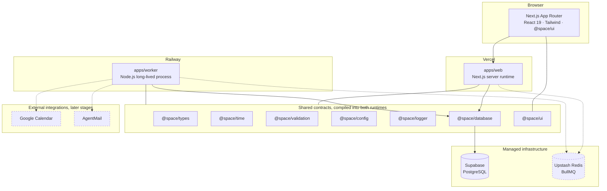

# Space

**Space is a personal planning platform.** Tasks, deadlines, calendar events and reminders live in
one canonical timeline, continuously resolved by a deterministic scheduling engine.

This repository is at **Stage 03 — Identity**. What exists today is the engineering foundation (a
Turborepo monorepo, shared contracts, a polished marketing surface, an independently deployable
worker, CI), a PostgreSQL schema with migrations, a deterministic clock, timezone-safe calendar
arithmetic, a server-only database package, and the authentication layer: Google sign-in, database
sessions, an encrypted credential store, onboarding that feeds the engine, and a deterministic
end-to-end route for testing. The Space Engine, calendar integration and background jobs are
scheduled for later stages and are **not** implemented here.

---

## Table of contents

- [Product vision](#product-vision)
- [Architectural principles](#architectural-principles)
- [Architecture](#architecture)
- [Monorepo structure](#monorepo-structure)
- [Applications](#applications)
- [Packages](#packages)
- [Local setup](#local-setup)
- [Environment variables](#environment-variables)
- [Database](#database)
- [Development commands](#development-commands)
- [Database](#database)
- [Testing](#testing)
- [Build](#build)
- [Deployment model](#deployment-model)
- [Adding a new package](#adding-a-new-package)
- [Conventions](#conventions)

---

## Product vision

A user's **Space** is their day: everything they have committed to, in one place. Space does not just
store that list — it is responsible for **when** each item happens, and for keeping that answer
correct as the day changes.

That responsibility is discharged by the **Space Engine**: a set of deterministic units that resolve
priorities, deadlines, conflicts and workload into a concrete schedule.

| #   | Engine                   | Responsibility                                   |
| --- | ------------------------ | ------------------------------------------------ |
| 01  | Planning                 | Turns intent into candidate work for a horizon   |
| 02  | Scheduling               | Places work into concrete time blocks            |
| 03  | Priority                 | Orders competing work under one ruleset          |
| 04  | Conflict                 | Detects and resolves overlapping commitments     |
| 05  | Deadline                 | Works backwards from dates that cannot move      |
| 06  | Rescheduling             | Repairs the plan with the smallest possible edit |
| 07  | Workload                 | Enforces capacity so days stay achievable        |
| 08  | Calendar synchronisation | Reconciles Space with external calendars         |
| 09  | Notification             | Decides what is worth interrupting a user for    |
| 10  | Monitoring               | Observes drift between the plan and reality      |

The engine is **rule-based and deterministic**. The same inputs always produce the same schedule, and
every decision traces back to the rule that produced it.

> **No AI.** There is no LLM, generative model, ML system or AI API anywhere in this project, and
> none will be introduced. Scheduling is a constraint problem, not a prediction problem.

---

## Architectural principles

1. **Space is the source of truth** for planned work. Google Calendar is an integration, not the
   database.
2. **The web application and the worker are independently deployable.** Neither imports the other.
3. **Background work never depends on serverless execution.** Long-running and retryable work belongs
   to the worker process, not to a request handler.
4. **No in-memory timers for production scheduling.** Durable scheduling will be handled by BullMQ on
   Redis.
5. **Domain logic lives outside React components.** Components render; packages decide.
6. **External integrations are isolated behind dedicated packages**, so a provider can be replaced
   without touching the domain.
7. **Contracts are shared, implementations are not.** Types and validation are reusable by both
   runtimes; server implementation is not reachable from the browser.
8. **Timestamps are instants.** Wall-clock strings without an offset are rejected at the boundary,
   and timezones are stored as IANA identifiers so DST is resolved at evaluation time.
9. **Secrets never enter the client bundle**, and never enter the repository.
10. **Modular boundaries inside one repository.** Services can be split out later if scale requires
    it; premature microservices are not a design goal.

---

## Architecture



Solid edges exist today. Dashed nodes are planned for later stages and have no code in this
repository yet.

**Why two runtimes.** Planning work is continuous, retryable and occasionally long-running:
reconciling calendars, recomputing schedules, sending notifications. Serverless functions are the
wrong shape for that — they have execution limits and no durable process identity. The worker is an
ordinary Node process that owns that work, and the Next.js application stays a request/response
surface.

---

## Monorepo structure

```
space/
├── apps/
│   ├── web/                    Next.js 16 application (App Router)
│   └── worker/                 Standalone Node.js background runtime
├── packages/
│   ├── config/                 Environment schemas and validated configuration
│   ├── auth/                 Authentication, sessions and credential encryption
│   ├── database/               Prisma schema, migrations, seed, repositories
│   ├── eslint-config/          Shared flat ESLint configurations
│   ├── logger/                 Structured logging (pino)
│   ├── time/                   Clock abstraction and timezone-safe calendar math
│   ├── types/                  Framework-free domain types and vocabulary
│   ├── typescript-config/      Shared tsconfig bases
│   ├── ui/                     React component library (shadcn/ui foundation)
│   └── validation/             Zod schemas and boundary parsing
├── docs/authentication.md   Identity, session model, E2E sign-in, security
├── docs/database.md            Schema, timezone rules, migrations, indexing
├── docker-compose.yml          Local PostgreSQL for migrations and integration tests
├── .github/workflows/ci.yml    Lint, typecheck, test, build, integration, e2e
├── turbo.json                  Task graph and caching
└── pnpm-workspace.yaml         Workspace members and the version catalog
```

Packages are **internal source packages**: they export TypeScript directly and are compiled by the
consumer (Next.js via `transpilePackages`, the worker via `tsup`). There is no per-package build
step, so there are no stale `dist/` artifacts and no build ordering to get wrong.

Only packages with real, load-bearing content exist today. The future modules named in the product
plan — `database`, `auth`, `space-engine`, `calendar`, `agentmail`, `queue`, `events`,
`notifications`, `analytics`, `telemetry` — are deliberately **not** scaffolded as empty
placeholders; see [Adding a new package](#adding-a-new-package) for the short process of adding one
when it has something to hold.

---

## Applications

### `apps/web` — Next.js application

- Next.js 16 App Router, React 19, strict TypeScript.
- Tailwind CSS v4 with design tokens defined in `src/app/globals.css`; the palette is near
  monochrome with a single warm accent, so hierarchy comes from typography and spacing.
- Components from `@space/ui` (shadcn/ui conventions: `cva` variants, Radix `Slot` for `asChild`).
- Geist Sans / Geist Mono, self-hosted through the `geist` package — no runtime font fetch.
- Motion (`motion/react`) used only for entrance reveals, and skipped entirely for users who prefer
  reduced motion.
- Accessibility: semantic landmarks, a skip link, visible focus rings, no anchor nested in a button.
- Security headers (`X-Content-Type-Options`, `X-Frame-Options`, `Referrer-Policy`,
  `Permissions-Policy`) are applied to every response from `next.config.ts`.

The landing page is the public surface. Behind it sits the authentication flow (Google sign-in at
`/login`, onboarding at `/onboarding`, a session-gated dashboard at `/dashboard`). The landing header
reads the session on the server and renders "Sign in" or "Open Space" accordingly, so no client
round-trip is needed to know the visitor's state.

### `apps/worker` — background runtime

An ordinary long-lived Node.js process with **no dependency on the Next.js runtime**. Today it:

- loads and validates its environment (`@space/config/worker`),
- initialises structured logging (`@space/logger`),
- serves `GET /healthz` (liveness) and `GET /readyz` (readiness) for the deployment platform,
- shuts down gracefully: on `SIGINT`/`SIGTERM` it stops advertising readiness, releases resources in
  reverse registration order, and gives up after `SHUTDOWN_TIMEOUT_MS`,
- treats an unhandled rejection or uncaught exception as fatal and exits non-zero so the platform can
  restart it cleanly.

It contains **no queue consumers and no business logic**. BullMQ, Redis and the Space Engine attach
to the same lifecycle in later stages.

The health server is not decoration: it is what a container platform polls, and it gives the process
a legitimate reason to hold the event loop open — instead of the common anti-pattern of an idle
`setInterval`.

---

## Packages

| Package                    | Runtime                     | Responsibility                                                                                                                                                                                                                      |
| -------------------------- | --------------------------- | ----------------------------------------------------------------------------------------------------------------------------------------------------------------------------------------------------------------------------------- |
| `@space/types`             | isomorphic, no dependencies | Branded scalars (`IsoDateTime`, `TimeZone`, `DurationMinutes`), the `Result` union, the log-level vocabulary. Framework-free, so both runtimes can depend on it without pulling anything in.                                        |
| `@space/validation`        | isomorphic                  | Zod schemas that turn untrusted input into branded types, plus `parseOrThrow` / `ValidationError`. Boundary errors list every issue and never echo the offending value, so a bad secret cannot leak into a log.                     |
| `@space/config`            | server only                 | Environment schemas per runtime (`/web`, `/worker`), validated eagerly at module load so a misconfigured process fails at boot rather than on first request. Includes a runtime guard that throws if evaluated in a browser bundle. |
| `@space/logger`            | Node only                   | Structured JSON logging on stdout with centralised redaction of credential-shaped fields. Writes synchronously so shutdown records are never lost on exit.                                                                          |
| `@space/ui`                | React                       | Component foundation: `cn()` (clsx + tailwind-merge) and the `Button` primitive with `cva` variants and `asChild` support.                                                                                                          |
| `@space/time`              | isomorphic                  | The `Clock` abstraction (`SystemClock`, `FixedClock`) and every timezone conversion in the product: calendar dates, DST-aware day ranges, wall-clock times. The only sanctioned reader of host time.                                |
| `@space/database`          | server only                 | Prisma schema, migrations, seed and repositories. Ownership-scoped, paginated, and idempotent where a sync depends on it. See [docs/database.md](docs/database.md).                                                                 |
| `@space/auth`              | server only                 | Identity, sessions and credential protection. Google sign-in, database sessions, encrypted OAuth tokens, onboarding writes, a deterministic E2E route, and rate-limiting. See [docs/authentication.md](docs/authentication.md).     |
| `@space/typescript-config` | tooling                     | `base`, `node`, `react-library` and `nextjs` tsconfig bases.                                                                                                                                                                        |
| `@space/eslint-config`     | tooling                     | Flat ESLint configs: `base` (type-aware), `node`, `react`, `next`.                                                                                                                                                                  |

### How secrets are kept out of the browser

Three layers, in the order they fire:

1. **Schema separation.** `webServerEnvSchema` and `webClientEnvSchema` are separate objects. Only
   `NEXT_PUBLIC_*` keys belong in the client schema, and a test asserts the server schema's key list
   so an accidental addition is caught in CI.
2. **`server-only`.** `apps/web/src/env.server.ts` imports `server-only`; if that module is ever
   pulled into a client bundle, **the build fails**.
3. **Runtime guard.** `assertServerRuntime()` throws if server configuration is somehow evaluated
   where `window` exists.

An ESLint rule additionally forbids components from importing `env.server` or `@space/config/worker`.

---

## Local setup

**Requirements**

- Node.js `>= 22.11` (developed on 24.18 — see `.nvmrc`)
- pnpm `>= 9.15` (`corepack enable pnpm`)

```bash
# 1. install
pnpm install

# 2. environment (optional — every variable has a safe default today)
cp apps/web/.env.example apps/web/.env.local
cp apps/worker/.env.example apps/worker/.env

# 3. run both applications
pnpm dev
```

- Web: <http://localhost:3000>
- Worker health: <http://localhost:8080/healthz>

---

## Environment variables

`.env.example` at the repository root is the **complete reference**, including variables reserved for
later stages. Each application has its own example file, and each reads only its own:

| File                       | Copy to               | Read by         |
| -------------------------- | --------------------- | --------------- |
| `apps/web/.env.example`    | `apps/web/.env.local` | `@space/web`    |
| `apps/worker/.env.example` | `apps/worker/.env`    | `@space/worker` |

**Required today:** `DATABASE_URL` (for migrations, seed and integration tests), `AUTH_SECRET` (for
session signing), and `GOOGLE_CLIENT_ID` / `GOOGLE_CLIENT_SECRET` (for sign-in) — all read from
`apps/web/.env.local`. Both applications still boot with no environment file at all (the web app
renders the public landing page, the worker returns health status), but any authenticated behaviour
requires the auth secrets.

| Variable              | Runtime | Default                 | Purpose                                            |
| --------------------- | ------- | ----------------------- | -------------------------------------------------- |
| `NODE_ENV`            | both    | `development`           | Runtime mode                                       |
| `APP_URL`             | web     | `http://localhost:3000` | Public origin, used for metadata and absolute URLs |
| `WORKER_NAME`         | worker  | `space-worker`          | Process identity in logs                           |
| `LOG_LEVEL`           | worker  | `info`                  | `trace` … `fatal`                                  |
| `HEALTH_PORT`         | worker  | `8080`                  | Health endpoint port                               |
| `SHUTDOWN_TIMEOUT_MS` | worker  | `10000`                 | Grace period before a forced exit                  |

| `DATABASE_URL` | both | — | Database connection string; required for the database commands and the auth session store |
| `AUTH_SECRET` | both | — | Session signing secret; >= 32 characters; required for auth to function |
| `GOOGLE_CLIENT_ID` | both | — | Google OAuth client id |
| `GOOGLE_CLIENT_SECRET` | both | — | Google OAuth client secret |
| `OAUTH_ENCRYPTION_KEY` | both | — | Per-deployment AEAD key for credential storage (`keyId:base64`) |

Rules: never commit a real env file (`.gitignore` excludes everything except `.env.example`), and
never put a credential behind `NEXT_PUBLIC_` — that prefix inlines the value into the browser bundle.

---

## Database

PostgreSQL, accessed through Prisma inside `@space/database`. The full treatment
— schema, entity diagram, timezone rules, constraints, indexing decisions,
migration strategy and the security review — is in
**[docs/database.md](docs/database.md)**. The essentials:

**Space is the source of truth for planned work.** An external calendar owns its
own events and is mirrored locally; `EventLog` is an append-only record of what
happened; `AgentAction` records the rule that produced each automated decision.

**Time is modelled in three distinct ways**, and the distinction is load bearing:

| Kind            | Column type                         | Example                                     |
| --------------- | ----------------------------------- | ------------------------------------------- |
| An instant      | `timestamptz(3)`, stored in UTC     | `Task.dueAt`, `Reminder.remindAt`           |
| A calendar date | `date`, no time and no offset       | `Space.date`, `Goal.targetDate`             |
| A time of day   | `int`, minutes since local midnight | `UserPreferences.morningNotificationMinute` |

A Space is one user's plan for one calendar date — `@@unique([userId, date])` —
and the day is anchored in the user's IANA timezone, never the server's. Every
conversion goes through `@space/time`, which also provides the `Clock`
abstraction: `SystemClock` in production, `FixedClock` in tests and the seed. A
lint rule rejects bare `new Date()` anywhere else.

**The database package is server-only**, enforced four ways: an ESLint rule
blocks component imports, `apps/web/src/server/database.ts` imports `server-only`
so a bad import fails the build, `serverExternalPackages` keeps Prisma out of
client chunks, and `assertServerRuntime()` throws at runtime.

```bash
docker compose up -d postgres
cp packages/database/.env.example packages/database/.env
pnpm db:migrate:deploy && pnpm db:seed
```

Neither application requires a database to boot. The worker opens a pool only
when `DATABASE_URL` is set, and then reports it through `/readyz`.

---

## Development commands

| Command                                | Description                                        |
| -------------------------------------- | -------------------------------------------------- |
| `pnpm dev`                             | Run every application in watch mode                |
| `pnpm dev:web`                         | Next.js only, on port 3000                         |
| `pnpm dev:worker`                      | Worker only, with `tsx watch`                      |
| `pnpm build`                           | Build every application                            |
| `pnpm build:web` / `pnpm build:worker` | Build one application                              |
| `pnpm start:worker`                    | Run the compiled worker (`node dist/index.js`)     |
| `pnpm lint`                            | ESLint across every workspace                      |
| `pnpm typecheck`                       | `tsc --noEmit` across every workspace              |
| `pnpm test`                            | Vitest unit tests                                  |
| `pnpm test:watch`                      | Vitest in watch mode                               |
| `pnpm test:e2e`                        | Playwright end-to-end tests (requires a build)     |
| `pnpm test:integration`                | Database integration tests (requires PostgreSQL)   |
| `pnpm db:generate`                     | Regenerate the Prisma client                       |
| `pnpm db:migrate`                      | Create and apply a migration (development only)    |
| `pnpm db:migrate:deploy`               | Apply pending migrations (the production command)  |
| `pnpm db:migrate:status`               | Compare the database against the migration history |
| `pnpm db:seed`                         | Load deterministic development data                |
| `pnpm db:studio`                       | Browse the data                                    |
| `pnpm format` / `pnpm format:check`    | Prettier write / verify                            |
| `pnpm clean`                           | Remove build output                                |

All tasks run through Turborepo, so repeated runs hit the local cache.

---

## Testing

**Unit — Vitest.** Each package owns its configuration and runs in isolation.

| Suite               | Covers                                                                                                                                                             |
| ------------------- | ------------------------------------------------------------------------------------------------------------------------------------------------------------------ |
| `@space/validation` | RFC 3339 parsing (including impossible calendar dates), IANA timezone checks, boundary errors that never echo their input                                          |
| `@space/auth`       | AEAD encrypt/decrypt round-trip, key rotation, `assertE2EAuthAllowed` guard, `e2eSecretMatches` constant-time semantics, onboarding writes, rate limiter windowing |
| `@space/config`     | Defaults, coercion, rejection of bad values, frozen snapshots, no client-key drift, and the auth env schema refusing `E2E_AUTH_ENABLED` in production              |
| `@space/logger`     | Structured output, credential redaction, level filtering, static bindings                                                                                          |
| `@space/worker`     | Shutdown ordering, idempotent shutdown, failure isolation, timeout behaviour, signal handling, health endpoint responses                                           |
| `@space/ui`         | `cn()` conflict resolution and `Button` accessibility/variants (Testing Library + jsdom)                                                                           |
| `@space/time`       | Clock injection, calendar dates across timezones, DST gaps and repeated hours, `date` column encoding                                                              |
| `@space/database`   | Enum parity with the Prisma schema, cursor pagination, error translation, health probe, seed determinism                                                           |

**End-to-end — Playwright.** Suites run against a **production build**, because a page that only
works under `next dev` is not evidence of anything. The landing page suite asserts the page renders,
the anchored sections exist, the security headers are sent, the header shows "Sign in" for anonymous
visitors, and unknown routes return a real 404. The auth suite exercises the deterministic
end-to-end route (`/api/auth/e2e`), verifies that `/login`, `/onboarding` and `/dashboard` gates
behave correctly, and signs the test user out — all against a real database, never a stub.

```bash
pnpm test                          # unit
pnpm build:web && pnpm test:e2e    # end-to-end
```

---

## Build

| Application   | Tool                     | Output                                          |
| ------------- | ------------------------ | ----------------------------------------------- |
| `apps/web`    | `next build` (Turbopack) | `.next/` — statically prerendered landing page  |
| `apps/worker` | `tsup` (esbuild)         | `dist/index.js` — single ESM bundle for Node 22 |

The worker bundle inlines the internal `@space/*` packages and leaves third-party dependencies
external, so the deployment target installs them from the lockfile.

**CI** (`.github/workflows/ci.yml`) runs on every push and pull request to `main`:

1. `verify` — install → format check → lint → typecheck → unit tests → build
2. `integration` — install → migrate a clean `postgres:17` service → seed → database integration tests
3. `e2e` — install → install Chromium → build web → Playwright

---

## Deployment model

Nothing is deployed at this stage. The intended model:

| Component       | Platform                    | Notes                                                                                      |
| --------------- | --------------------------- | ------------------------------------------------------------------------------------------ |
| Web application | **Vercel**                  | Root directory `apps/web`; build `pnpm build:web`                                          |
| Worker          | **Railway**                 | Persistent process; build `pnpm build:worker`, start `pnpm start:worker`; check `/healthz` |
| Database        | **Supabase PostgreSQL**     | Pooled `DATABASE_URL` for apps, `DIRECT_DATABASE_URL` for migrations                       |
| Queue / cache   | **Upstash Redis**           | BullMQ backing store                                                                       |
| Repository & CI | **GitHub / GitHub Actions** |                                                                                            |
| Errors & traces | **Sentry / OpenTelemetry**  | Later stage                                                                                |

The worker must never be deployed as a serverless function: it is designed to hold long-lived
connections and to drain in-flight work on shutdown.

---

## Adding a new package

The repository is structured so that a new module is additive, never a restructure.

1. `mkdir packages/<name>` with a `package.json` named `@space/<name>`, `"type": "module"`, and
   `"exports": { ".": "./src/index.ts" }` — internal packages ship source.
2. Extend the right tsconfig base (`base`, `node`, or `react-library`) and the matching ESLint config.
3. Add `lint`, `typecheck` and, where there is behaviour, `test` scripts — Turborepo discovers them
   automatically.
4. Declare it in the consumer's `dependencies` as `workspace:*`. For the web application, add it to
   `transpilePackages` in `next.config.ts`.

Planned modules and where they will sit:

| Package                                    | Stage | Purpose                                         |
| ------------------------------------------ | ----- | ----------------------------------------------- |
| `@space/auth`                              | 03    | Sessions and Google OAuth                       |
| `@space/space-engine`                      | 04    | Pure, deterministic engines over `@space/types` |
| `@space/queue`                             | 04    | BullMQ queues and job contracts                 |
| `@space/calendar`                          | 04    | Google Calendar, isolated behind an interface   |
| `@space/notifications`, `@space/agentmail` | 05    | Delivery channels                               |
| `@space/telemetry`                         | later | Sentry and OpenTelemetry wiring                 |

---

## Conventions

- **Strict TypeScript everywhere**: `strict`, `noUncheckedIndexedAccess`, `noImplicitOverride`,
  `noUnusedLocals`, `verbatimModuleSyntax`, `isolatedModules`.
- **Type-aware linting** through the TypeScript project service; floating promises and misused
  promises are errors, not warnings.
- **`new Date()` is banned by lint.** Reading the wall clock implicitly makes scheduling
  untestable — a clock must be injected. Tests are exempt.
- **Import boundaries are enforced by lint**: Node workspaces cannot import React, Next or
  `@space/ui`; components cannot import server configuration.
- **Path alias** `@/*` inside `apps/web`; workspace packages are always imported by package name.
- Prettier (100 columns, single quotes, trailing commas) with automatic Tailwind class sorting.
