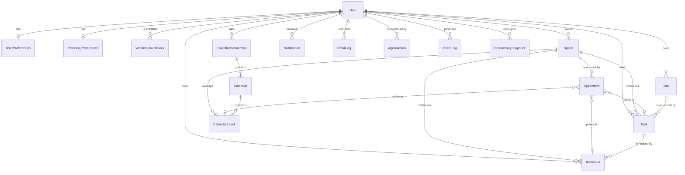

# Database and domain model

Stage 2 of Space. This document covers the persistence layer: what owns the data,
how time is represented, what the schema looks like, and how to run migrations
and the seed.

- [Source of truth](#source-of-truth)
- [The server-only boundary](#the-server-only-boundary)
- [Timezone rules](#timezone-rules)
- [The clock](#the-clock)
- [Entities](#entities)
- [Space items](#space-items)
- [Constraints the database enforces](#constraints-the-database-enforces)
- [Indexing decisions](#indexing-decisions)
- [Package API](#package-api)
- [Local setup](#local-setup)
- [Migrations](#migrations)
- [Seed](#seed)
- [Testing](#testing)
- [Security](#security)
- [Performance](#performance)

---

## Source of truth

**Space owns planned work.** Tasks, reminders, goals, Spaces and the plan itself
live in PostgreSQL and are authoritative.

**An external calendar owns its own events.** `CalendarEvent` is a mirror, kept
idempotently in step with the provider so the engines can reason about a user's
real day without a network call. The mirror is never treated as the origin of a
plan, and Space never becomes a copy of Google Calendar.

**The event log records what happened.** `EventLog` is append-only. Nothing
updates or deletes a row; an event that turns out to be wrong is corrected by a
later, compensating event. That is what makes it replayable, and what will let
Stage 7 read it as a transactional outbox.

**`AgentAction` records why.** Every decision the deterministic Space Engine
makes is written with the rule that fired and the inputs it read. There is no
model, no inference and no generated text anywhere in this system — the audit
trail exists so a user can always be told exactly why their day changed.

---

## The server-only boundary

`@space/database` must never reach a browser bundle. Four independent mechanisms
enforce that, in the order they fire:

| Layer   | Mechanism                                               | Failure mode                               |
| ------- | ------------------------------------------------------- | ------------------------------------------ |
| Lint    | `no-restricted-imports` in `apps/web/eslint.config.mjs` | `pnpm lint` fails                          |
| Build   | `apps/web/src/server/database.ts` imports `server-only` | `next build` fails                         |
| Bundler | `serverExternalPackages` in `next.config.ts`            | Prisma is never traced into a client chunk |
| Runtime | `assertServerRuntime()` in `createDatabaseClient`       | Throws if `window` exists                  |

The runtime guard is the Stage 1 helper from `@space/config`, reused rather than
reimplemented. `server-only` lives in the Next.js app rather than in the package,
because that module throws when imported from plain Node — which is exactly what
the worker is.

Access flows one way:

```
Client Component  ─X─►  @space/database
Server Component  ───►  apps/web/src/server/database.ts  ───►  @space/database
Worker            ───►  apps/worker/src/database.ts      ───►  @space/database
```

---

## Timezone rules

These are the rules the whole product depends on. They are enforced by types, by
column types, and by tests.

1. **An instant is stored as `timestamptz(3)`.** PostgreSQL keeps it in UTC and
   returns it with an offset. Everything that names a moment — `dueAt`,
   `remindAt`, `startAt`, `completedAt`, `occurredAt` — is one of these.
2. **A calendar date is stored as `date`.** `Space.date`, `Goal.targetDate` and
   `ProductivitySnapshot.date` are days, not instants. A day covers a different
   span of instants in every timezone, so storing it as a timestamp would let a
   server in another region shift a user's whole plan by one day.
3. **A time of day is stored as an integer.** Minutes since local midnight,
   `0–1439`. "Remind me at 08:30" is a wall-clock intention that must survive a
   DST change and a move between timezones; attaching a date to it would destroy
   that.
4. **The user's IANA timezone is authoritative.** It lives on
   `UserPreferences.timeZone` and is _never_ inferred from the server, the
   request, or `Intl.DateTimeFormat().resolvedOptions()` on a server.
5. **A Space captures the zone it was planned in.** `Space.timeZone` is copied
   onto the row at creation, so changing timezone next month cannot silently
   re-interpret days already planned.
6. **Conversions happen in one place.** `@space/time` owns every conversion:
   `toCalendarDate`, `startOfCalendarDate`, `calendarDateRange`,
   `instantAtLocalTime`, `toDatabaseDate`, `fromDatabaseDate`. Nothing else in
   the codebase does date arithmetic.

### Daylight saving

`calendarDateRange` returns a half-open `[start, end)` where the end is the start
of the _next_ day, so a 23-hour or 25-hour day is covered exactly once with no
gap and no overlap. The behaviour at a transition is pinned by tests:

| Situation                                      | Resolution                                                     |
| ---------------------------------------------- | -------------------------------------------------------------- |
| Local time that never happens (spring forward) | Shifted forward by the length of the gap — 01:30 becomes 02:30 |
| Local time that happens twice (fall back)      | The later, post-transition occurrence                          |

### Reading a `date` column

The driver represents `date` as a `Date` pinned to midnight UTC. It must be read
with UTC getters, never local ones — `fromDatabaseDate` does this. Repositories
convert at the boundary, so callers only ever see `YYYY-MM-DD` strings.

---

## The clock

Nothing reads the wall clock implicitly. `@space/time` exports:

- `Clock` — `now()`, `nowMs()`, `nowIso()`
- `SystemClock` / `systemClock` — production, reads `Date.now()`
- `FixedClock` — tests and the seed; `advance`, `advanceMinutes`, `advanceDays`, `set`

A repo-wide ESLint rule (`no-restricted-syntax`) rejects bare `new Date()`, so
`SystemClock` is the only sanctioned reader of host time. It is written as
`new Date(Date.now())` and needs no lint exception.

Repository functions that record a time take it as a parameter (`occurredAt`,
`syncedAt`, `computedAt`, `readAt`) rather than calling a clock themselves. The
caller injects one; a replay produces identical timestamps.

---

## Entities



| Model                  | Purpose                               | Notes                                                                                               |
| ---------------------- | ------------------------------------- | --------------------------------------------------------------------------------------------------- |
| `User`                 | An account                            | No credentials. Stage 3 adds a separate `Account` table for Google identities and encrypted tokens. |
| `UserPreferences`      | Timezone, locale, notification times  | One row per user. Times are minutes since local midnight.                                           |
| `PlanningPreferences`  | Engine parameters                     | Strategy, autonomy level, focus and buffer budgets.                                                 |
| `WorkingHoursBlock`    | Availability                          | Relational, not JSON: the scheduler will query it.                                                  |
| `Space`                | One user's plan for one calendar date | `@@unique([userId, date])` — the core product invariant.                                            |
| `SpaceItem`            | The ordered contents of a Space       | Typed index over concrete rows, exclusive arc.                                                      |
| `Task`                 | A unit of work                        | `spaceId` nullable: an inbox task has no day yet.                                                   |
| `Reminder`             | A time-based nudge                    | Structured recurrence columns; `parentId` for future occurrences.                                   |
| `Goal`                 | A longer-horizon objective            | Minimal; exists so `Task.goalId` has a target.                                                      |
| `CalendarConnection`   | A provider account link               | Sync cursor, granted scopes, no tokens.                                                             |
| `Calendar`             | One calendar in a connection          | `isSelected` gates synchronisation.                                                                 |
| `CalendarEvent`        | A mirrored external event             | `@@unique([calendarId, externalId])` makes import idempotent.                                       |
| `Notification`         | Something to tell the user            | Priority `CRITICAL…SILENT`; `SILENT` is recorded, never pushed.                                     |
| `EmailLog`             | One outbound email attempt            | Template name only — the rendered body is never stored.                                             |
| `AgentAction`          | A deterministic engine decision       | Rule name plus the factors it read.                                                                 |
| `EventLog`             | An immutable domain event             | Monotonic `sequence` for outbox reads.                                                              |
| `ProductivitySnapshot` | A daily roll-up                       | Only what is expensive to recompute.                                                                |

### Task status transitions

Defined once in `@space/types` and applied in `work.changeTaskStatus`:

```
INBOX       → PLANNED, IN_PROGRESS, COMPLETED, CANCELLED
PLANNED     → INBOX, IN_PROGRESS, COMPLETED, CANCELLED, MISSED, RESCHEDULED
IN_PROGRESS → PLANNED, COMPLETED, CANCELLED, MISSED, RESCHEDULED
MISSED      → PLANNED, RESCHEDULED, CANCELLED
RESCHEDULED → PLANNED, IN_PROGRESS, CANCELLED, MISSED
COMPLETED   → (terminal)
CANCELLED   → (terminal)
```

`completedAt` is derived from the transition, never accepted from the caller.

---

## Space items

The requirement is that a Space can return its contents — tasks, reminders and
calendar events together — in one query, in a deterministic order.

Three designs were considered:

1. **Three separate queries, merged in application code.** Simple, but the merge
   order lives in the application, and pagination across the three is awkward.
2. **A generic polymorphic table** (`entityType` string + `entityId` string). No
   referential integrity, no cascade, and every read needs a manual join. This is
   the fragile design the brief warns against.
3. **A typed index with an exclusive arc.** `SpaceItem` holds three nullable,
   _real_ foreign keys and a `kind` discriminator. A CHECK constraint enforces
   that exactly one is set and that it matches `kind`.

Option 3 was chosen. It keeps referential integrity and cascade deletes, gives
one row per item to order by, and lets a single `findMany` with `include` return
the whole timeline — no N+1, no UNION.

Ordering is total, so two reads of unchanged data always return the same
sequence:

```
position ASC, scheduledStart ASC NULLS LAST, createdAt ASC, id ASC
```

`position` is sparse (gaps of 10) so a reorder rewrites one row.

---

## Constraints the database enforces

Application validation can be bypassed — by a migration, a `psql` session, a
future service. These are CHECK constraints in
`prisma/migrations/*_domain_constraints/migration.sql`:

| Table                                                                   | Constraint                                                                            |
| ----------------------------------------------------------------------- | ------------------------------------------------------------------------------------- |
| `space_items`                                                           | Exactly one of `taskId` / `reminderId` / `calendarEventId` is set                     |
| `space_items`                                                           | The set key matches `kind`                                                            |
| `space_items`, `tasks`                                                  | `scheduledEnd >= scheduledStart`                                                      |
| `calendar_events`                                                       | `endAt >= startAt`                                                                    |
| `working_hours_blocks`                                                  | `startMinute < endMinute`, both within a day                                          |
| `user_preferences`, `planning_preferences`                              | Every minute-of-day within `[0, 1440)`                                                |
| `planning_preferences`, `tasks`, `productivity_snapshots`, `email_logs` | Durations and counts are non-negative                                                 |
| `reminders`                                                             | `recurrenceInterval >= 1`; a recurrence ends at a date _or_ after a count, never both |

Uniqueness:

| Table                    | Key                                       | Why                                                 |
| ------------------------ | ----------------------------------------- | --------------------------------------------------- |
| `users`                  | `email`                                   | One account per address; input is lower-cased first |
| `spaces`                 | `(userId, date)`                          | One canonical plan per day                          |
| `calendar_events`        | `(calendarId, externalId)`                | Makes sync idempotent                               |
| `calendars`              | `(connectionId, externalId)`              | Same, one level up                                  |
| `calendar_connections`   | `(userId, provider, providerAccountId)`   | Re-authorising updates in place                     |
| `email_logs`             | `(provider, providerMessageId)`           | Provider webhooks arrive keyed by their own id      |
| `productivity_snapshots` | `(userId, date)`                          | Recomputing a day is safe to re-run                 |
| `space_items`            | `taskId`, `reminderId`, `calendarEventId` | An item appears on at most one timeline             |

---

## Indexing decisions

Indexes were chosen from the access patterns the product actually has, not by
indexing every column — each one costs write throughput and storage.

| Index                                                | Query it serves                              |
| ---------------------------------------------------- | -------------------------------------------- |
| `spaces(userId, date DESC)`                          | "My last 30 days", "the week ahead"          |
| `spaces(userId, status)`                             | Draft or active days needing a planning pass |
| `tasks(userId, status, dueAt)`                       | The main authenticated read: what is open    |
| `tasks(userId, dueAt)`                               | Deadline Engine: upcoming deadlines          |
| `tasks(userId, scheduledStart)`                      | Conflict Engine: what occupies a window      |
| `tasks(spaceId, status, priority)`                   | One day's list, in priority order            |
| `space_items(spaceId, position)`                     | The timeline read                            |
| `reminders(deliveryState, remindAt)`                 | The dispatcher's only query                  |
| `calendar_events(userId, startAt)`                   | Overlap search for one user                  |
| `calendar_events(syncState, lastSyncedAt)`           | Rows still owing a push or pull              |
| `notifications(userId, createdAt DESC)`              | The notification list                        |
| `notifications(userId, readAt)`                      | Unread badge count without scanning history  |
| `notifications(deliveryState, scheduledAt)`          | What is due to be delivered                  |
| `event_logs(sequence)`                               | Outbox cursor, strict global order           |
| `event_logs(userId, occurredAt DESC)`                | A user's activity feed                       |
| `event_logs(aggregateType, aggregateId, occurredAt)` | The history of one entity                    |
| `agent_actions(spaceId, occurredAt DESC)`            | "Why does today look like this?"             |

Deliberately **not** indexed: free-text columns (no search feature yet), boolean
flags with low selectivity, and `updatedAt` (nothing queries by it).

---

## Package API

```ts
import { getDatabaseClient, spaces, work, audit } from '@space/database';

const db = getDatabaseClient();

const space = await spaces.getOrCreateSpace(db, userId, {
  date: '2026-03-30',
  timeZone: 'Europe/Lisbon',
});

const task = await work.createTask(db, userId, { title: 'Ship it', priority: 'HIGH' });
await work.changeTaskStatus(db, userId, task.id, 'PLANNED', clock.now());

await audit.appendEvent(db, userId, {
  eventType: 'TASK_CREATED',
  aggregateType: 'TASK',
  aggregateId: task.id,
  occurredAt: clock.now(),
});
```

Three rules shape this API:

1. **The handle comes first.** Every function takes `Database` as its first
   argument, so the same code runs inside `$transaction` and outside it.
2. **Ownership is a parameter, never an assumption.** `userId` comes from the
   session and appears in the `where` clause of every read and write. Mutations
   use `updateMany` with the owner in the predicate and report whether a row
   matched — an `update` by id alone would let a caller reach another user's row.
3. **Prisma is not hidden.** There is no repository-per-table ceremony. A
   function exists where a _rule_ has to hold — ownership scoping, a pagination
   cap, a status transition, an idempotent upsert. Everything else uses Prisma
   directly.

Errors are translated at this boundary: `UniqueConstraintError`,
`RecordNotFoundError`, `InvalidTransitionError`, `DatabaseError`. Prisma codes
never escape the package, and an unrecognised failure is wrapped rather than
re-thrown, so a stack trace carrying a connection string cannot leak upward.

---

## Local setup

```bash
# 1. start PostgreSQL
docker compose up -d postgres

# 2. configure the package
cp packages/database/.env.example packages/database/.env

# 3. apply the schema and load development data
pnpm db:migrate:deploy
pnpm db:seed
```

Neither application requires a database to boot: the web app has no data layer
wired to a page yet, and the worker opens a pool only when `DATABASE_URL` is set.

---

## Migrations

| Command                  | What it does                                                                             |
| ------------------------ | ---------------------------------------------------------------------------------------- |
| `pnpm db:generate`       | Regenerate the Prisma client (runs automatically before lint, typecheck, test and build) |
| `pnpm db:migrate`        | Create and apply a migration from schema changes — development only                      |
| `pnpm db:migrate:deploy` | Apply pending migrations — the production command                                        |
| `pnpm db:migrate:status` | Compare the database against the migration history                                       |
| `pnpm db:studio`         | Browse the data                                                                          |

Prisma 7 moved connection URLs out of the schema. They live in
`packages/database/prisma.config.ts`, which also loads `.env` explicitly —
Prisma no longer does that implicitly. The application never reads that file: it
passes a connection to `PrismaClient` through the `@prisma/adapter-pg` driver
adapter.

### Production migration strategy

1. Migrations are **forward-only**. A mistake is corrected by a new migration,
   never by editing one that has already been applied.
2. Deployment runs `prisma migrate deploy` and nothing else. `migrate dev`,
   `migrate reset` and `db push` are development commands and must never run
   against production — they can drop data.
3. Migrations use `DIRECT_DATABASE_URL`. Supabase's pooled endpoint uses
   transaction pooling, which cannot hold the advisory lock a migration needs.
4. Destructive changes are split into expand/contract steps across two deploys:
   add the new column, backfill it, switch the code, then drop the old column in
   a later release. A single deploy that both adds and drops cannot be rolled
   back.
5. The migration step runs before the new application version is promoted, so
   the old version must tolerate the new schema. That is the reason for step 4.

---

## Seed

`pnpm db:seed` loads deterministic development data: two users in different
timezones (Europe/Lisbon and Asia/Kolkata), four Spaces, six tasks covering every
priority and five statuses, a one-off and a recurring reminder, a calendar
connection with two events, read and unread notifications, and a productivity
snapshot.

Two properties matter and are tested:

- **Deterministic.** `buildSeedData(clock)` is pure and takes a `FixedClock`, so
  two runs produce byte-identical data. Asserted without a database in
  `seed-data.test.ts`.
- **Idempotent.** Every write is an upsert on a fixed identifier, so re-running
  updates rather than duplicates. Verified by running it twice and comparing row
  counts.

All data is fictional; addresses use the reserved `.test` domain. A test asserts
that no credential-shaped string appears anywhere in the seed.

---

## Testing

| Suite       | Command                 | Needs a database |
| ----------- | ----------------------- | ---------------- |
| Unit        | `pnpm test`             | No               |
| Integration | `pnpm test:integration` | Yes              |

Unit tests cover enum parity between `@space/types` and the Prisma schema,
pagination, error translation, the health probe, and seed determinism. They run
on a clean checkout with no services.

Integration tests cover what only a real database can prove: unique constraints,
CHECK constraints, cascade deletes, `date` column semantics, enum storage,
ownership scoping, cursor pagination across pages, and idempotent upserts. They
read `TEST_DATABASE_URL` (falling back to `DATABASE_URL`) and **skip entirely**
when neither is set — the suite is opt-in, never a silent pass. CI runs them
against a `postgres:17` service container, applying migrations to an empty
database first, which is also how "the migrations work from clean" stays true.

---

## Security

- **No credential is ever logged.** Prisma query events carry bound parameters;
  the logger bridge reads only `duration` and `query`. `DATABASE_LOG_QUERIES` is
  off by default and intended for local debugging.
- **Health checks say nothing useful to an attacker.** `checkDatabaseHealth`
  returns `{ status, latencyMs }` — no host, no driver code, no error text. The
  worker's `/readyz` reports each dependency as a boolean.
- **Errors do not leak.** Unrecognised database failures are wrapped;
  `RecordNotFoundError` does not distinguish "absent" from "not yours", which
  would otherwise let a caller enumerate identifiers.
- **Reads are explicit.** `userPublicFields` selects columns by name, so a column
  added in a later migration cannot silently appear in an API response.
- **Ownership is enforced server-side**, in the `where` clause, always. No schema
  in `@space/validation` accepts a `userId` from a request body.
- **No dynamic SQL.** Every query goes through Prisma's query builder. The single
  raw statement in the codebase is the parameterless `SELECT 1` health probe.
- **Deleting a user erases their data** through `onDelete: Cascade`, verified by
  an integration test.
- **No tokens are stored yet.** When Stage 3 adds OAuth, credentials go in a
  separate table with encryption at rest — never in `User` or
  `CalendarConnection`.

---

## Performance

- Every list that can grow without bound returns a `Page` with a cursor. Offset
  pagination is not used: it skips rows that shift under concurrent writes and
  degrades as the offset grows.
- Page size is capped at `MAX_PAGE_SIZE` (200) inside `resolveLimit`, so a caller
  cannot request an entire history.
- `listSpacesInRange` requires a range and rejects one longer than 370 days.
- The unread badge is a `count` against an index, never fetch-and-length.
- The Space timeline is one query with `include`, which is the N+1 that
  `SpaceItem` exists to prevent.
- Cross-user dispatcher queries (`listDueReminders`, `listDueNotifications`) take
  a bounded batch ordered by due time, matching their covering index.
